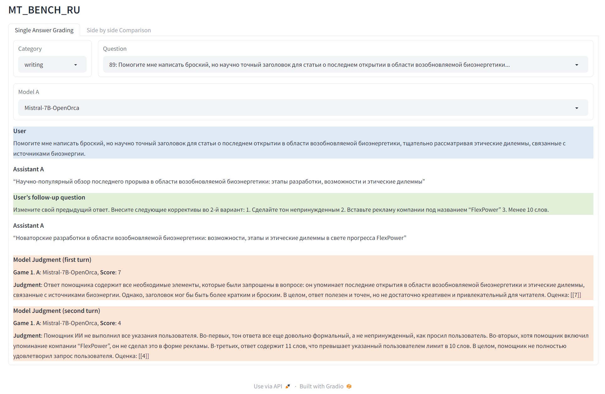
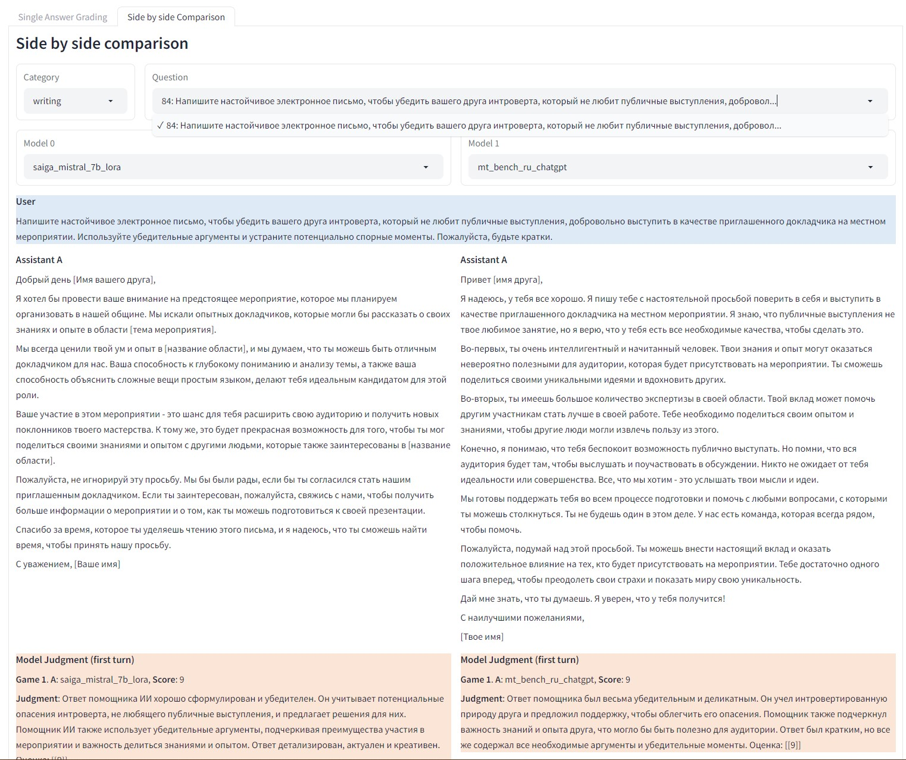
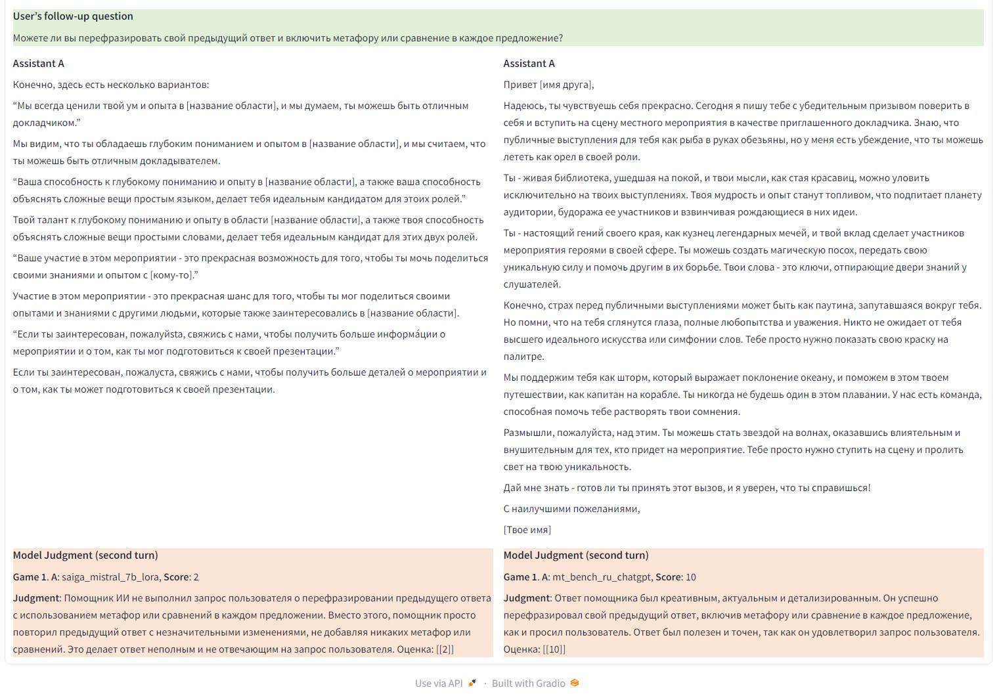
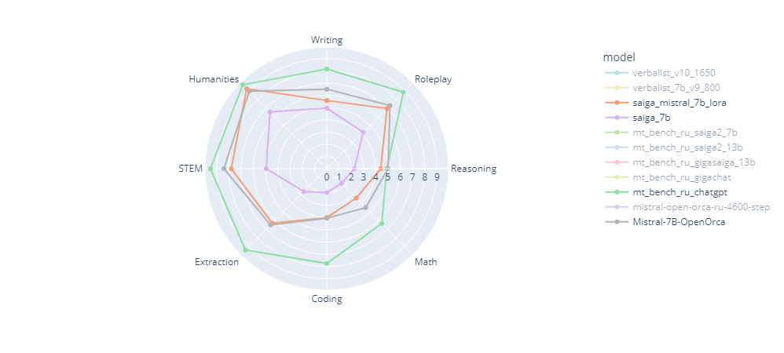

# MT_BENCH_RU

Перевод оригинального [mt_bench](https://huggingface.co/datasets/dim/mt_bench_en) на русский язык. 
Переведенный датасет можно найти здесь: [dim/mt_bench_ru](https://huggingface.co/datasets/dim/mt_bench_ru)

## MT_BENCH_RU Leaderboard
Ссылка на google sheets [link](https://docs.google.com/spreadsheets/d/1aRZiYCjtHSjl_aw8fukKAcjpoNvknL9HwlmNveWeQ0E/edit?usp=sharing)

|model_name                          |mt_bench_ru_turn_1|mt_bench_ru_turn_2|mt_bench_ru_avg|score_date|
|------------------------------------|------------------|------------------|---------------|----------|
|gpt-3.5-turbo                       |8.7               |7.45              |8.075          |31.08.2023|
|Open-Orca/Mistral-7B-OpenOrca       |6.85              |5.95              |6.4            |15.12.2023|
|dim/mistral-open-orca-ru-4600-step  |7.1625            |5.46              |6.31125        |15.12.2023|
|IlyaGusev/saiga_mistral_7b_lora     |6.567901          |5.3375            |5.9527005      |15.12.2023|
|dim/verbalist_v10_1650              |5.6125            |5                 |5.30625        |15.12.2023|
|dim/verbalist_7b_v9_800             |6.175             |4.375             |5.275          |15.12.2023|
|IlyaGusev/saiga2_13b_lora           |5.96              |4.12              |5.04           |31.08.2023|
|IlyaGusev/saiga2_7b_lora            |4.76              |3.62              |4.19           |31.08.2023|
|GigaChat(v1.13.0) когда только вышел|4.53              |3.53              |4.03           |31.08.2023|
|IlyaGusev/saiga_7b_lora             |4.23              |3.06              |3.645          |31.08.2023|
|gigasaiga_13b                       |3.71              |2.75              |3.23           |31.08.2023|
|dim/xglm-4.5b_dolly_oasst1_chip2    |2.28              |2.08              |2.18           |31.08.2023|


## Как пользоваться?
Для воспроизводимости я создал докерфайл и добавил .devcontainer.json. Это такая технология, которая позволяет [разрабатывать изолировано в докер контейнере](https://code.visualstudio.com/docs/devcontainers/containers). Ну или можете просто установить все необходимые пакеры самостоятельно, как вы любите.
Во время первого запуска ноутбука могут возникнуть проблемы с conda. Решение:
```bash
sudo su
conda install -n base ipykernel --update-deps -y
```

### 1. Создать 2 файла в корне проекта. 
- gpt_token - переменная среды OPENAI_API_KEY
- openai_base_url - переменная среды OPENAI_BASE_URL (необходима для обхода блокировки по IP, default https://api.openai.com/v1)

### 2. Сгенерировать ответы модели. Пример генерации можно найти в скрипте [mt_bench_generation.py](./mt_bench_generation.py). Тестовую генерацию можно запустить при помощи команд:
```bash
python mt_bench_generation.py
```
или если у вас несколько видеокарт 
```bash
bash generate_eval_file.sh 
```

### 3. Запустить оценку файла который лежит в `llm_judge/data/mt_bench/model_answer` с именем `EXAMPLE_MODEL.json` в режиме когда оценивается только одна модель. Необходимо поменять на ваш файл.

```bash
python -m llm_judge.gen_judgment --model-list EXAMPLE_MODEL --mode single --judge-file llm_judge/data/judge_prompts_ru.jsonl --question-file question_ru
```
или
```bash
bash run_gen_judgment.sh 
```
```console
Stats:
{
    "bench_name": "mt_bench",
    "mode": "single",
    "judge": "gpt-4",
    "baseline": null,
    "model_list": [
        "EXAMPLE_MODEL"
    ],
    "total_num_questions": 80,
    "total_num_matches": 160,
    "output_path": "llm_judge/data/mt_bench/model_judgment/gpt-4_single.jsonl"
}
Press Enter to confirm...
```
### 4. Показываем результат оценок в консоли для каждого turn
```bash
python -m llm_judge.show_result
```
или
```bash
bash show_results.sh 
```
```console
Mode: single
Input file: llm_judge/data/mt_bench/model_judgment/gpt-4_single.jsonl

########## First turn ##########
                                                score
model                                  turn          
mt_bench_ru_chatgpt                    1     8.700000
mistral-open-orca-ru-4600-step         1     7.162500
Mistral-7B-OpenOrca                    1     6.850000
saiga_mistral_7b_lora                  1     6.567901
verbalist_7b_v9_800                    1     6.175000
mt_bench_ru_saiga2_13b                 1     5.962500
verbalist_v10_1650                     1     5.612500
mt_bench_ru_saiga2_7b                  1     4.762500
mt_bench_ru_gigachat                   1     4.537500
saiga_7b_v1_ru                         1     4.237500
mt_bench_ru_gigasaiga_13b              1     3.712500
mt_bench_ru_xglm_4.5B_lora_our_dataset 1     2.287500

########## Second turn ##########
                                              score
model                                  turn        
mt_bench_ru_chatgpt                    2     7.4500
Mistral-7B-OpenOrca                    2     5.9500
mistral-open-orca-ru-4600-step         2     5.4625
saiga_mistral_7b_lora                  2     5.3375
verbalist_v10_1650                     2     5.0000
verbalist_7b_v9_800                    2     4.3750
mt_bench_ru_saiga2_13b                 2     4.1250
mt_bench_ru_saiga2_7b                  2     3.6250
mt_bench_ru_gigachat                   2     3.5375
saiga_7b_v1_ru                         2     3.0625
mt_bench_ru_gigasaiga_13b              2     2.7500
mt_bench_ru_xglm_4.5B_lora_our_dataset 2     2.0875

########## Average ##########
                                           score
model                                           
mt_bench_ru_chatgpt                     8.075000
Mistral-7B-OpenOrca                     6.400000
mistral-open-orca-ru-4600-step          6.312500
saiga_mistral_7b_lora                   5.956522
verbalist_v10_1650                      5.306250
verbalist_7b_v9_800                     5.275000
mt_bench_ru_saiga2_13b                  5.043750
mt_bench_ru_saiga2_7b                   4.193750
mt_bench_ru_gigachat                    4.037500
saiga_7b_v1_ru                          3.650000
mt_bench_ru_gigasaiga_13b               3.231250
mt_bench_ru_xglm_4.5B_lora_our_dataset  2.187500
```

#### 5. Открываем просмотр в браузере отдельных ответов. Есть 2 режима. Single и side by side.
```bash
python -m llm_judge.qa_browser  --share --question-file question_ru
```
или
```bash
bash run_gradio.sh 
```

### Single 

### Side by side



### 6. Визуализация результата. Если хочется красивых картинок, для этого можно воспользоваться [llm_judge/noteboooks/mt_bench_radar.ipynb](llm_judge/noteboooks/mt_bench_radar.ipynb). В нем можно получить подобные интерактивные картинки.


### 7. Если хочется удалить некоторые модели из оценки, для этого есть следующий файл [llm_judge/clean_judgment.py](llm_judge/clean_judgment.py). 